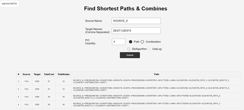
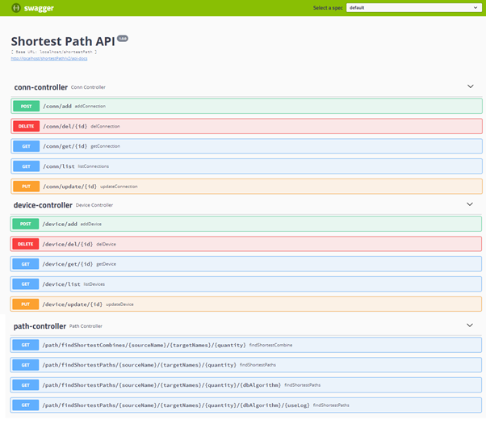
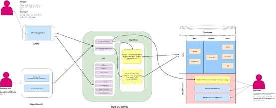

### Material Transportation

#### 1. Project Information

> **ProjectName**
> 
> Shortest Path Algorithm for Material Transportation
> 
> **Background**
> In the world of modern industry, a streamlined and optimized material  ransport process not only reduces operational costs but also enhances overall productivity. Hence, a robust shortest path algorithm could be required by plant managers to improve production efficiency. This project aims to develop a shortest path algorithm in SQL that will return a list of shortest paths between source and destinations through a list of devices, ultimately minimizing the time taken for material transportation.
> 
> **Solution**
> 
> Solving the shortest path problem for material transportation within a factory,
> involving multiple objectives and common path challenges. Implemented using Java and MySQL.

#### 2. Project files description

**bin** : *folder for tools*

> `start.bat` : one click to build and run the local projec, then visite the link:
> http://localhost/shortestPath/swagger-ui.html (Requirement: JDK 8+, Maven)
> `start.sh` : one click script for linux, mac.

**src/resource/script** : *position for procedure, (TODO: which will be synchronized to database autometically.)*

> **`findMultiplePath(source_name,target_name,path_max,enable_log)`**
> `source_name`: name of source spot
> `target_name`: name of target spot
> `path_max`: how many paths do you want
> `enable_log`: TRUE/FALSE, if set TRUE, the algorithm execution will be recorded in details.
> e.g.: CALL findMultiplePath ('Device A','Device G',6, FALSE);

#### 3. Remote Demo

**Algorithm page**

> [http://47.106.108.49/shortestPath](http://47.106.108.49/shortestPath/)
> 
> 

**Management page**

> http://47.106.108.49/shortestPath/swagger-ui.html
> 
> 

#### 4. Algorithm decision

**Current Algorithm Selection**

> ****Task1: find N shortest path for source S to target T
> 
> - The problem addressed in this project is the single-source shortest path problem in a graph. The available algorithms to solve shortest path problems include UCS, A*, Dijkstra, and Bellman.
> 
> - Since the project's business scenario does not involve negative cycles, we can exclude the computationally expensive Bellman's algorithm (O(VE)).
> 
> - Due to the absence of suitable heuristic functions in the known conditions, A* cannot be used alone when searching for a single shortest path.
> 
> - Because the goal of finding the shortest path is well-defined, and we don't need to search the entire graph, we can implement based on UCS, which can exit the search earlier than Dijkstra in best case, through it maintains the same average time complexity.
> 
> - Two solutions were offered here. One is based on Mysql, another is based on Java + Mysql 
> 
> **Task2: find N shortest combination for source S to multiple target T1...Tk**
> 
> - The solution offered the shortest cost for the best combinations, including paths and shared segment in each combination. These can be viewed through the visual web page.
> 
> - Solution for this task based on Java + Mysql. 

**Future Optimization Strategies**

> If the business model changes in the future, and the network becomes very large, we can optimize in the following ways:
> 
> - Exploit the symmetry of undirected graphs by concurrently searching in both the forward and reverse graphs to select the more favorable path.
>    Alternatively, you can simply choose nodes with fewer out-degrees from the start and end points for experimentation.
> 
> - If you need to find a large number of shortest paths (e.g., 100 paths), you can also accelerate using a hybrid approach of Dijkstra and A* in an N+1 pattern. In the first round, perform a reverse Dijkstra search to find a heuristic function, then apply A*.
> 
> - If we face pretty large graph network in the future, we may consider distributed computation and big data technique.

### 5. Software Architecture

> 

> We adopted an Model-View-Controller (MVC) project architecture.
> 
> - Since we need to solve the shortest path problem based on the
>   client's data, we require a database. Given the options provided by the client
>   (MySQL/MSSQL), we chose MySQL due to its higher community activity, aligning with our team's skillset.
> 
> - Databases are costly resources unsuitable for extensive
>   computations and logic control.
> 
> - Traditional databases like MySQL are less adept at handling graph
>   problems than specialized graph databases like neo4j. Therefore, we placed the primary algorithm implementation on the Java server (the single-target path algorithm has implementations in both Java and MySQL, but the multi-target path algorithm was too complex, so we implemented it in Java only).
> 
> - We provided an intuitive UI for users to facilitate operations. From the Unified Modeling Language (UML), it is evident that users have three entry points. General users can run the algorithm via the Algorithm User
>   Interface (UI) and receive computation results instantly. The client company's managers can use the API UI to add, delete, or modify device and connection data; developers can view all interface information for secondary development via the API UI; and DBA can view the algorithm's execution history logs and results through stored procedures and directly run the single-target shortest
>   path algorithm on the DB.
